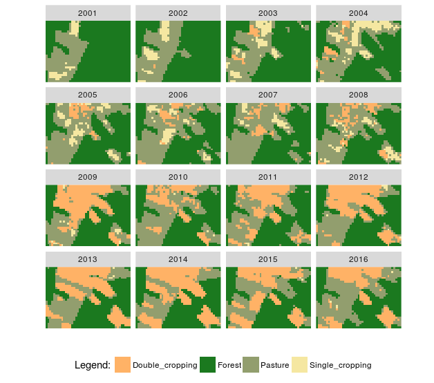
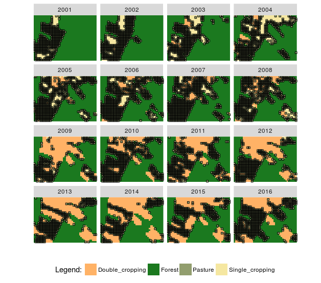
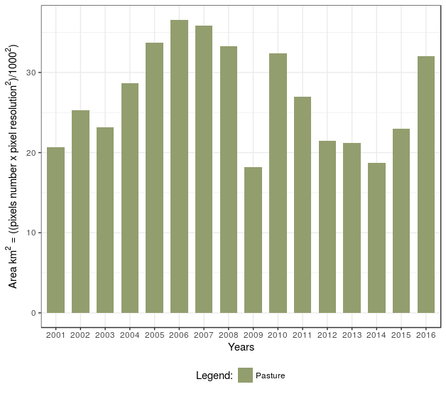
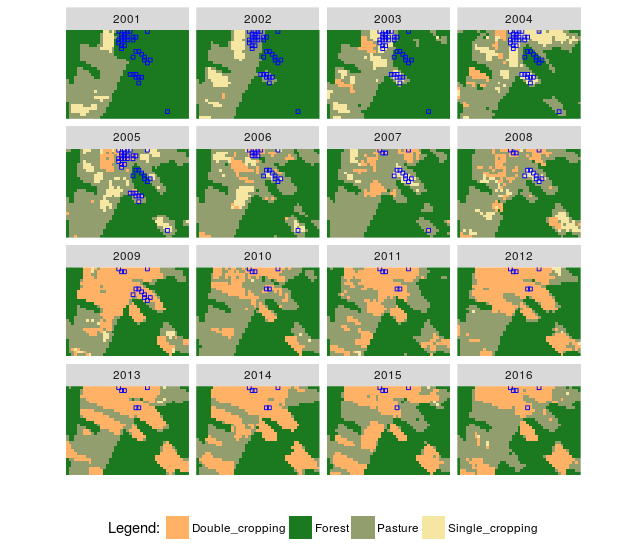
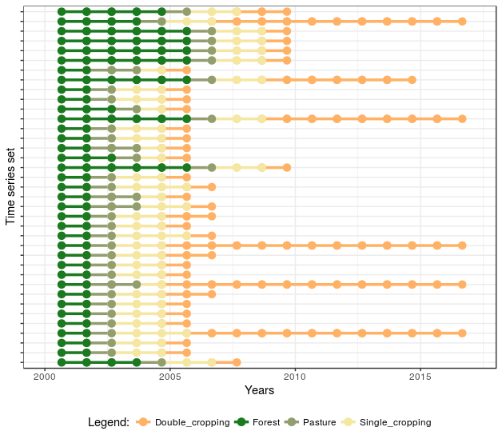

<h2>Spatialtemporal Interval Logic Formalism - STILF</h2>

This package perfoms event extraction from a set of time series classified. The events extracted consist of a sequence of events that answer a specific question, such as <i>Which events of "Forest" areas were replaced by "Pasture"?</i>

With package "stilf is possible to build questions using thirteen Allen's interval temporal logic relationships and also others extended from their study. I suggest the reader read <a href="http://cse.unl.edu/~choueiry/Documents/Allen-CACM1983.pdf"> (Allen 1983)</a> and <a href="http://www.cs.ucf.edu/~lboloni/Teaching/EEL6938_2007/papers/Allen-GeneralTheoryActionTime.pdf"> (Allen 1984) </a> for more details. Besides, is possible to generate graphics with event information and plot maps with results. Using these events the user can to perform analysis on time series data discover land use and land cover changes.

wtss is an R client package for handling Web Time-Series Service (WTSS) in the client side at <a href="https://github.com/e-sensing/wtss.R">https://github.com/e-sensing/wtss</a>

Classification method can be found using package dtwSat at <a href="https://github.com/vwmaus/dtwSat">https://github.com/vwmaus/dtwSat</a>

Tools to satellite image time series analysis can be found using package sits at <a href="https://github.com/gilbertocamara/sits">https://github.com/gilbertocamara/sits</a>

<h3>Prerequisites: </h3> 
<ul>
  <li><a href="http://git-scm.com/">Git</a></li>
  <li><a href="http://www.r-project.org/">R</a></li>
  <li><a href="http://www.rstudio.com/">Rstudio</a></li>
  <li>A set of time series classified data </li>
  <li>The stilf requires "devtools" package is available. </li> 
</ul>

<h3>How to use the package:</h3>
<ul>
  <li>Open RStudio</li>
  <li>Install devtools <code>install.packages("devtools")</code> </li>
  <li>Load devtools <code>library(devtools)</code> </li>
  <li>Install the stilf package <code>install_github("ammaciel/stilf")</code> </li>
</ul>

<h3>Example 1</h3>

 - Load the stilf package <code>library(stilf)</code>

 - Load a example data <code>data("example_data_TWDTW")</code>

 - Create new variable tibble format <code>example.tb <- stilf_data</code>

 - Plot example.tb <pre class="R">stilf_plot_maps_input(example.tb, EPSG_WGS84 = TRUE, custom_palette = TRUE, RGB_color = c("#FFB266", "#1b791f", "#929e6e", "#f5e7a1"))</pre>

Fig. 1. Plot time series data classified

 - Apply stilf_standard_date_events to standardize start_date and end_date columns <code>examples_1.tb <- stilf_standard_date_events(data_tb = examples.tb, month_year = "09", day_month = "01")</code>

 - Apply stilf_predicate_occur function to discover events of Pasture. For this is necessary create a for loop to read all datas and not only one pixel over time 

<pre class="R">
# amount of data for class
data.frame(table(example_1.tb$label))

# p = properties of objects :
p1 <- "Pasture"

# t = interval:
t1 <- stilf_interval("2000-08-01","2017-03-01")

# Test occur for many time series in a dataframe
QuestionOccurs <- function(data_tb, p, t){
  
  df <- data_tb 
  coord <- unique(df$index)
  output <- df[FALSE,]
  
  for(x in 1:length(coord)){
    
    # selection only one pixel on time for execution 
    temp <- df[which(as.character(df$index) == coord[x]),]
    
    # verify if predicate occur
    if (nrow(event2 <- stilf_predicate_occur(temp, p1, t1)) >= 1
        
    ){
      temp0 <- rbind(event2)
    } else {
      temp0 <- NULL
    }
    output <- dplyr::bind_rows(output,temp0)
  }
  return(output)
}

output.tb <- QuestionOccurs(example_1.tb, p = p1, t = t1)
output.tb
</pre>

 - See example1.tb plot with stilf_plot_maps_input function <pre class="R">stilf_plot_maps_input(examples_1.tb, EPSG_WGS84 = TRUE, custom_palette = TRUE, RGB_color = c("#FFB266", "#1b791f", "#929e6e", "#f5e7a1"))</pre>

 - See all events discover to answer question with stilf_plot_maps_events function <pre class="R">stilf_plot_maps_events(output_df, EPSG_WGS84 = TRUE, custom_palette = TRUE, RGB_color = c("#FFB266", "#1b791f", "#929e6e", "#f5e7a1"), shape_point = 0, colour_point = "black", size_point = 1)</pre>

Fig. 2. Plot events discovered from time series classified data

 - See barplot total area in square kilometers <pre class="R">stilf_plot_barplot_events(output_df, custom_palette = TRUE, RGB_color = "#929e6e", pixel_resolution = 250)</pre>

Fig. 3. Barplot with value

<h3>Example 2</h3>

 - Apply stilf_predicate_occur function to discover for a sequence of events of <i>Forest, Pasture, Single cropping and Double cropping</i> in this order. 

<pre class="R">
# p = properties of objects :
p1 <- c("Forest", "Pasture", "Single_cropping", "Double_cropping")

# t = interval:
t1 <- stilf_interval("2000-08-01","2017-03-01")

df <- examples_1.tb
# create a tibble with the same column names 
output_tb2 <- df[FALSE,] # Always run this 
coord <- unique(df$index)

# Apply over all input data
for(x in 1:length(coord)){
  temp.tb <- df[which(as.character(df$index) == coord[x]),]
  temp_final.tb <- stilf_event_transitions(temp.tb, properties = p1, time_intervals = t1)
  output_tb2 <- dplyr::bind_rows(output_tb2, temp_final.tb)
}
output_tb2
</pre>

 - See example1.tb plot with stilf_plot_maps_input function <pre class="R">stilf_plot_maps_input(df, EPSG_WGS84 = TRUE, custom_palette = TRUE, RGB_color = c("#FFB266", "#1b791f", "#929e6e", "#f5e7a1"))</pre>

 - See all events discover to answer question with stilf_plot_maps_events function <pre class="R">stilf_plot_maps_events(output_tb2, EPSG_WGS84 = TRUE, custom_palette = TRUE, RGB_color = c("#FFB266", "#1b791f", "#929e6e", "#f5e7a1"), shape_point = 0, colour_point = "blue", size_point = 1)</pre>

Fig. 4. Plot events discovered from time series classified data

 - See plot of sequence with events over time <pre class="R">stilf_plot_sequence_events(output_tb2, show_y_index = FALSE, end_date = "2017-03-01", custom_palette = TRUE, RGB_color = c("#FFB266", "#1b791f", "#929e6e", "#f5e7a1"))</pre>

Fig. 5. Plot of sequence with events

